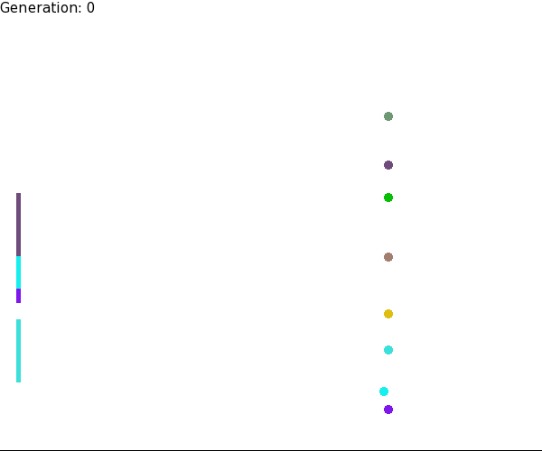
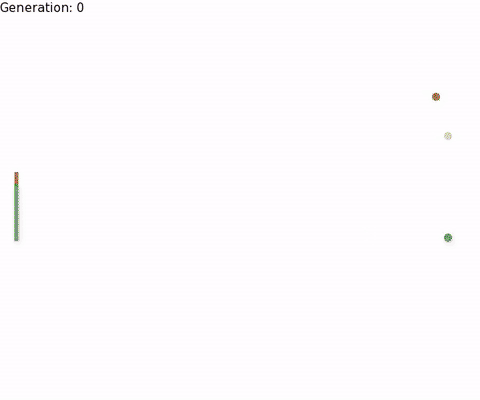

Genetic Pong

Developed using C++ and SFML for graphical display.

A generational approach to AI learning where using genetic techniques such as crossover and mutation, an infinite game of Pong is created.






The clip above is also in the repository as [docs/demo.mp4](docs/demo.mp4).


## Building on Linux

Install SFML 2 and a compiler:

```bash
sudo apt install build-essential cmake libsfml-dev
```

Build:

```bash
cmake -S . -B build -DCMAKE_BUILD_TYPE=Release
cmake --build build -j
```

Run:

```bash
./build/GeneticPong
```

The program picks up a system font automatically. On-screen text turns off if it finds none.
